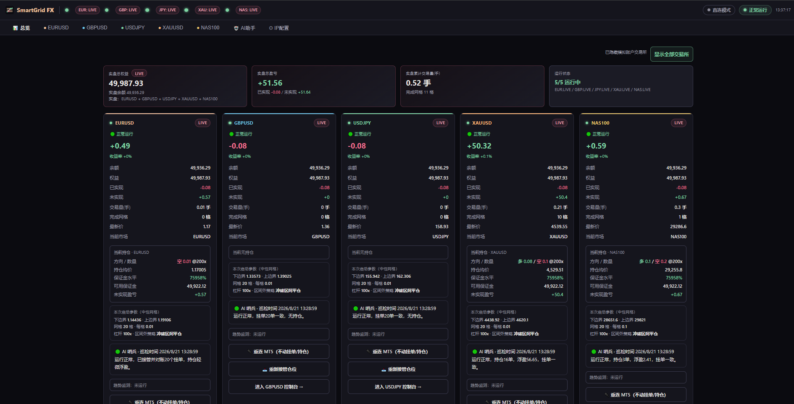
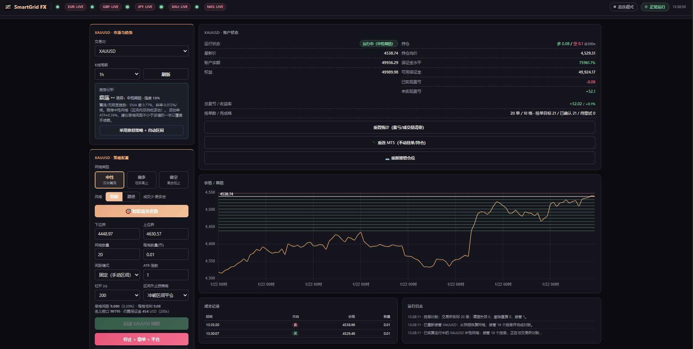

<div align="center">

# 🤖 SmartGrid FX

**外汇多品种网格交易总控台 · 网页仪表盘 · AI 助手 · 免费开源**

<p align="center">
  
</p>

[](https://github.com/OneGearGo/smartgrid-fx/stargazers)
[](LICENSE)
[](https://nodejs.org)

**如果这个项目帮到了你，请点亮 ⭐ Star —— 这是对开源作者最大的支持！**

</div>

---

## 📸 界面预览

<div align="center">

**总览仪表盘** — 五品种实时状态、盈亏、持仓、保证金水平一屏掌握



**设置中心** — 品种槽位管理 / 策略模板库 / 风控熔断 / 系统状态



</div>

---

## ✨ 功能亮点

- 🕸 **五品种网格**：EURUSD / GBPUSD / USDJPY / XAUUSD / NAS100 同时跑，互不干扰
- 📐 **三种网格模式**：中性（双向震荡）/ 做多（低买高止）/ 做空（高空低止）
- 🔄 **自动补格锁利润**：成交一格自动在相邻价反向挂单，震荡市滚动收割
- 📊 **ATR 自适应间距**：按波动率自动调间距与区间，专业 EA 的做法
- 🛡 **风控熔断**：回撤熔断 + 日亏损限额，挂机自动止损（专业 EA 的核心风控）
- 🤖 **AI 助手**：市况分析（五品种各自报告）、风控哨兵、每日复盘日报
- 🖥 **网页仪表盘**：浏览器实时看持仓/盈亏/挂单，手机也能访问
- 🔌 **双桥支持**：Python 桥 + MQL5 EA 桥，单/多终端环境通吃
- 🔐 **安全设计**：防重复挂单、崩溃自动恢复、重启接管仓位、仅本地监听

> [!CAUTION]
> 这是交易软件，不是收益保证或投资建议。`live` 会使用真实账户、真实保证金并发送真实订单，可能产生手续费、滑点、强平或全部损失。第一次使用必须保持所有槽位为 `paper`；确认功能和配置后，再用小额资金逐个启用实盘。

---

## ☕ 支持这个项目

如果你觉得这个项目有用：

| 方式 | 说明 |
| --- | --- |
| ⭐ **Star** | 点亮 GitHub Star，让更多人看到它 |
| 🍵 **打赏** | 微信/支付宝赞赏码见下方，或[爱发电](https://afdian.com)赞助主页 |
| 📣 **分享** | 转发给做量化/外汇的朋友 |
| 🐛 **反馈** | 提 Issue / PR，一起改进 |

> 作者花了上百小时打磨这套系统。你的每一次支持（Star/打赏/反馈）都是持续更新的动力 🙏

<!-- 赞赏码占位：放你的微信/支付宝收款码图片


-->

---

## 🚀 三步启动（paper 模式）

1. 安装依赖：`npm ci`（需要 Node.js 20+）
2. 复制配置：`Copy-Item .env.example .env`，确认 `MT5_TERMINAL` 指向你的终端
3. 启动：`npm start`，浏览器打开 `http://127.0.0.1:8283`

> 若 8283 被占用（比如原版 WGALL 还在跑），改 `.env` 里的 `PORT=8284`。

## 切换实盘（测试完成后）

在 `.env` 中：

```ini
# 1. 确认 MT5 终端登录的是你的实盘账户（或填写凭据）
MT5_TERMINAL=F:\MT5\terminal64.exe
MT5_LOGIN=你的实盘账号
MT5_PASSWORD=你的实盘密码
MT5_SERVER=你的经纪商服务器

# 2. 把要实盘的槽位改为 live（逐个启用，先用小资金）
XAU_MODE=live
```

实盘要点：

- **每个槽位有独立 magic 号**（30000+），网格单不会误撤你手动挂的单；
- 启动程序前先到 MT5 终端确认登录账户和杠杆；
- 切换 live 后，仪表盘该槽位显示红色 LIVE 徽标；
- 实盘下单走 MT5 真实挂单（`order_send`），成交检测靠轮询对账；
- 平仓/停止前请到 MT5 复核。

## 主要功能

- 五品种统一总览，区分实盘与模拟盘权益、盈亏、成交量、完成格数、持仓和健康状态；
- 中性、做多、做空三种等差网格；
- 15 分钟、1 小时、4 小时、1 天 K 线趋势判断和稳健/激进智能参数；
- 启动前保证金预检、手续费与格距提示、杠杆上限、真实挂单对账和失败安全重试；
- 调整区间、手动补格、撤单保留持仓、停止并平仓、统计重置；
- 未托管持仓的只减仓回收阶梯、按现价重开网格或市价平仓；
- 进程重启后根据 `.state.json` 接管上次运行中的网格；
- HTTP(S)/SOCKS5 代理和出口 IP 检测；
- 可选 AI 风控哨兵、出区间建议、多周期市况分析、日报、通知和需人工确认的对话操作。

## 架构

```
F:\fx-grid-bot\
├─ bridge\mt5_bridge.py     # MT5 常驻桥（stdio JSON-lines，Python MetaTrader5 库）
├─ src\
│  ├─ grid.js / bot.js      # 网格数学 + 网格引擎（复刻自原版，未改动）
│  ├─ trend.js / indicators.js / persist.js / proxy.js / overview.js / ai\
│  ├─ server.js             # HTTP + SSE（REST 路由 /api/eur|gbp|jpy|xau|nas/*）
│  ├─ config.js             # 5 槽位配置解析
│  └─ exchange\mt5\         # MT5 适配器：bridge.js 客户端 + base.js 行情 + paper.js 模拟撮合 + mt5.js 实盘
│     └─ platforms\         # ★ 新平台接入位（见 docs/接入新平台.md）
├─ public\index.html        # 前端仪表盘
└─ docs\                    # 文档
```

### 行情/订单链路

```
MT5 终端 ──(Python MetaTrader5 库 或 MQL5 桥 EA)──> 桥 ──> Node 适配器 ──> GridBot 引擎 ──> REST/SSE ──> 浏览器
```

- **paper 模式**：MT5 真实行情（K线/价格）+ 本地模拟撮合（含手续费），不产生真实订单；
- **live 模式**：MT5 真实行情 + 真实挂单/平仓，成交检测靠轮询对账；
- 终端离线（如回测/未打开）时自动降级为合成行情并持续重试，恢复后自动切回真实行情。

### 两种 MT5 桥接方式（.env 的 `MT5_BRIDGE`）

| 方式 | 原理 | 适用 |
| --- | --- | --- |
| `python`（默认） | MetaTrader5 Python 库，依赖终端 IPC dispatcher（端口 22346） | 单终端环境 |
| `ea`（推荐多终端） | MQL5 桥 EA 在终端进程内跑，WebRequest 走本地 HTTP（8383） | **同一台电脑有实盘+模拟两个 MT5 终端时必选**（IPC 端口只能被一个终端占用） |

EA 桥模式部署：见 [docs/MT5桥EA部署指南.md](docs/MT5桥EA部署指南.md)（拖 EA 到图表 + 白名单 + 开自动交易，一次性操作）。

## 对接更多外汇平台（预留位）

当前 5 个槽位都使用 `PLATFORM=mt5`。架构已在 `src/exchange/platforms/` 预留接入位——每个槽位可独立指定平台，实现新平台的适配器后即可接入（详见 [docs/接入新平台.md](docs/接入新平台.md)）。网格引擎不感知具体平台，只依赖统一适配器接口。

## 开发者运行

```powershell
npm ci
npm test
npm start
```

## 安全默认值

- `.env.example` 不含任何凭据，所有槽位默认 `paper`；
- 服务默认只监听 `127.0.0.1`，仪表盘不应直接暴露到公网；
- `.env`、`.state.json`、日志均已加入 `.gitignore`；
- 程序没有提现、转账或修改 API key 的页面和本地 API；
- AI 只能提出白名单操作，必须由用户在网页确认后才调用正常交易接口。

## 开源协议

MIT License。第三方交易所、SDK、数据源有各自的条款、地域限制与费用，使用者需要自行确认资格并遵守其规则。
